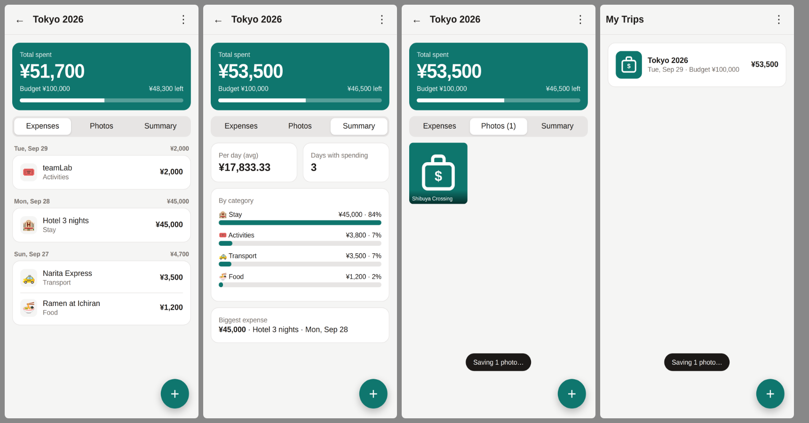

# TripLang 🧳

A simple personal app for tracking trip expenses and saving photos of the places you visit.
It runs on your phone as an installable web app (PWA): no app store, it works offline, and
all your data stays on your phone.



## Features

- **Trips**: one per journey, each with its own currency and an optional budget
- **Total spent**: shown at the top, with a budget progress bar and how much is left or over
- **Expenses**: amount, category (Food, Transport, Stay, Activities, Shopping, Other), note and date, grouped by day with daily totals. Tap an expense to edit or delete it.
- **Photos**: add pictures from your camera or gallery, tag each one with the place and a caption. They are resized automatically to save space.
- **Summary**: spending by category, average per day and your biggest expense
- **Export**: download a trip's expenses as CSV (opens in Excel or Google Sheets)
- **Backup and restore**: save everything, including photos, to one file and restore it on a new phone
- **Offline**: works abroad without mobile data
- **Dark mode**: follows your phone's setting

## Put it on your phone

1. **Host it (one time):** GitHub Pages on a *private* repo needs GitHub Pro. On a free account, first make the repo public (Settings → General → Danger Zone → Change visibility). That is safe: only the app code is public, your expenses and photos stay on your phone. Then on GitHub, open the repo's **Settings → Pages**. Under *Build and deployment*,
   pick **Deploy from a branch**, choose `main` and `/ (root)`, then click **Save**.
   After about a minute your app is live at `https://rmaming.github.io/TripLang/`.
2. **Install it:**
   - **iPhone (Safari):** open the link, tap **Share**, then **Add to Home Screen**.
   - **Android (Chrome):** open the link, tap **⋮**, then **Install app** (or **Add to Home screen**).
3. Open **TripLang** from your home screen. It runs full-screen, like a normal app.

> Your data is stored on your phone, not online. Use **⋮ → Back up all data** now and then
> (for example, after each trip) so you don't lose anything if you change or reset your phone.

## Run locally

```sh
python3 -m http.server 8000
# then open http://localhost:8000
```
